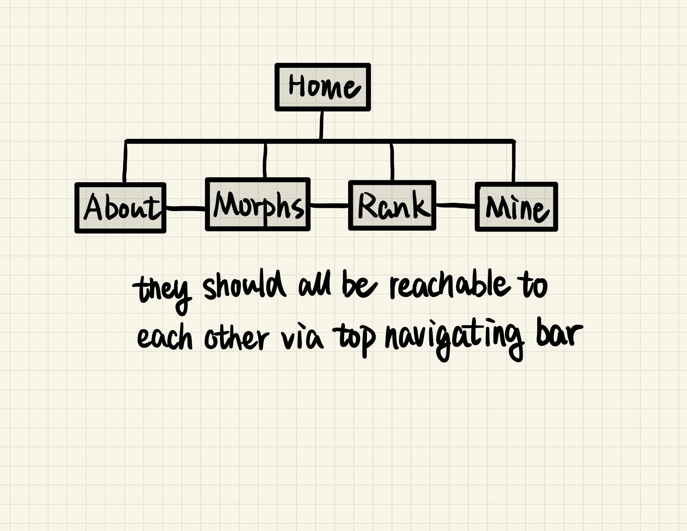

# Corn Snake Morphs Handbook

## Milestone 2 log

* Deployment on AWS EC2
* SSL certificate with certbot
* Hosted zone yyklc.com on Route 53, record cornsnake.yyklc.com route to EC2 instance
* MongoDB Atlas set up

TODO

* Working form 
* Upload toy sample to cloud db with images
* Learn react.js, have basic index.html
* pm2 running in background 

===

## Overview

__Corn snakes__ are some of the best pet snakes. The are doctile, don't mind being handled, and come in a variety of truly beaeutiful colors thanks to gene mutation and expression. In fact corn snake colarations (usually referred to as __morphs__) are so varied and prized that hobbyists and breeders have dedicated their lives to acquiting and breeding these snakes into over 900 recognized morphs. 

For those curious and interested in raising a corn snake, selecting from an unlimited collection of colors and patterns could be overwhelming. This handbook, documented with some of the most notable and popular morphs, allow you to navigate with filter, add your favorite morphs into collection with an account, as well as view the popularity ranking calculated from all uses's collections.

## Data Model

Note that although there are over 900 corn snake morphs, there are only 5 wild-type genetic strains and 28 selected gene traits. Most of the morphs can be mada from combining these strains into double, triple, and all the way up to six traits. 

The application will store users, morphs, and traits.

* Each user can have one collection, an array of morphs (via reference)
* Each morph can have multiple traits (by embedding)

An Example User:
```javascript
{
  username: "foo",
  hash: // a password hash,
  collection: // an array of references to Morph object
}
```

An Example Morph:
```javascript
{
  name: "Fire Stripe",
  type: 3,
  traits: ["Amelanistic", "Diffused", "Stripe"],
  hatchlingImg: ,
  adultImg: ,
  hits: 10 // number of users that add it into collection
}
```

types dictionary:
```javascript
{
  0: "Wildtypes",
  1: "Single Recessive",
  2: "Double Trait",
  3: "Triple Trait",
  4: "Quad Trait",
  5: "Five Trait",
  6: "Six Trait",
  7: "Singe Dominant",
  9: "Selectively Bred"
}
```

traits dictionary:
```javascript
{
  wildtype: 
    ['Alabama', 'Keys', 'Miami', 'Normal', 'Okeetee'], 
  recessive: 
    ['Lavender', 'Microscale', 'Motley', 'Red Coat', 'Scaleless', 'Strawberry', 'Stripe', 'Sunkissed', 'Sunrise', 'Terrazzo', 'Ultra', 'Amelanistic', 'Anerythristic', 'Caramel', 'Charcoal', 'Christmas', 'Cinder', 'Diffused', 'Dilute', 'Hypomelanistic', 'Kastanie', 'Lava'], 
  dominant: 
    ['Het Palmetto', 'Palmetto', 'Buf', 'Masque', 'Tessera', 'Caramel']
}
```

## [Link to Commented First Draft Schema](db.mjs) 

## Wireframes

/home - page shown first when user visit


/about - page for showing overview for the web app


/morphs - page for showing all morphs


/rank - page for showing top ranking morphs


/mine - page for showing users's collection 


log in - pop up window for registering


## Site map



## User Stories or Use Cases

1. as a non-registered user, I can register a new account with the site
2. as a non-registered user, I can view all morphs and filter by traits on morphs page.
3. as a non-registered user, I can view the top ranking morphs on rank page. 
4. as a user, I can log in to the site.
5. as a user, I can add favourite morphs into my collections on morphs page.
6. as a user, I can view all of the morphs I've added on mine page.
7. as a user, I can uncheck morphs in my collection on mine page.
 
## Research Topics

* (2 points) CSS Framework: [bootstrap](https://getbootstrap.com/)
* (2 points) DOM Management: [jQuery](https://jquery.com/)
* (3 points) User Authentication: [passport.js](https://www.passportjs.org/)
* (5 points) Frontend Framework: [react.js](https://react.dev/)

## [Link to Initial Main Project File](app.mjs) 

## Annotations / References Used
1. [upload and retrieve image on MongoDB using Mongoose](https://www.geeksforgeeks.org/upload-and-retrieve-image-on-mongodb-using-mongoose/)
2. [passport.js](https://www.passportjs.org/)
3. [jQuery](https://jquery.com/)
4. [react.js](https://react.dev/)
5. [bootstrap](https://getbootstrap.com/)


